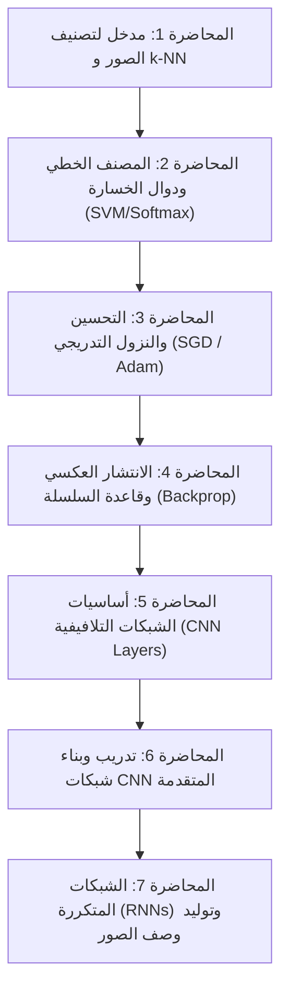

# 🧠 ملخص كورس CS231n: التعلم العميق في الرؤية الحاسوبية
### Stanford University — CS231n: Deep Learning for Computer Vision

مستودع عربي شامل يحتوي على تلخيصات منظمة ومفصلة لمحاضرات الكورس الأكاديمي العالمي **CS231n: Deep Learning for Computer Vision** والمقدّم من **جامعة ستانفورد (Stanford University)**.

---

## 📖 عن الكورس (About CS231n)

يُعتبر كورس **CS231n** من أشهر وأقوى المناهج التعليمية المتخصصة في **التعلم العميق (Deep Learning)** وتطبيقاته المتقدمة في **الرؤية الحاسوبية (Computer Vision)**. يغطي الكورس الانتقال التدرجي من المبادئ الرياضية الأساسية لتصنيف الصور إلى أحدث المعماريات المعقدة للشبكات العصبية.

### أهم المحاور والمفاهيم التي يغطيها الكورس:
- **تصنيف الصور (Image Classification):** فهم طبيعة الصور الرقمية والتحديات البصرية والنهج القائم على البيانات (*Data-Driven Approach*).
- **المصنفات الخطية ودوال الخسارة (Linear Classifiers & Loss Functions):** دراسة *Multiclass SVM Loss* و *Softmax Loss* وطرق التنظيم (*Regularization L1/L2*).
- **التحسين والنزول التدريجي (Optimization & Gradient Descent):** خوارزميات التحسين (*SGD, Momentum, RMSProp, Adam*) واستراتيجيات معدل التعلم (*Learning Rate Scheduling*).
- **الانتشار العكسي (Backpropagation):** تدفق التدرجات الحسابية وقاعدة السلسلة (*Chain Rule*) في المخططات الحسابية (*Computational Graphs*).
- **الشبكات العصبية التلافيفية (Convolutional Neural Networks - CNNs):** طبقات التلافيف (*Conv Layers*)، التجميع (*Pooling Layers*)، ودوال التنشيط اللاخطية (*Activations* مثل ReLU و Leaky ReLU).
- **تدريب وبناء المعماريات المتقدمة:** استراتيجيات التدريب العملية، التسوية بالدفعات (*Batch Normalization*)، الإسقاط (*Dropout*)، ونقل التعلم (*Transfer Learning*).
- **معالجة البيانات المتتالية (Sequential Data & RNNs):** الشبكات العصبية المتكررة (*RNNs*)، شبكات *LSTM*، وتطبيقات توليد وصف للصور (*Image Captioning*).

---

## 🗂️ فهرس الملفات والمحاضرات (Repository Index)

يوفر هذا المستودع ملفات Markdown مستقلة لكل محاضرة مدعومة بالرسومات التوضيحية والمعادلات الرياضية، بالإضافة إلى ملخص شامل وخريطة ذهنية تفاعلية:

| الملف | العنوان | أبرز المواضيع والمحاور |
| :--- | :--- | :--- |
| 📑 [ملخص-الكورس-الكامل.md](file:///c:/Users/hadi/Desktop/Deep%20Learning%20for%20Computer%20Vision/ملخص-الكورس-الكامل.md) | **الملخص الشامل للكورس** | نظرة شاملة مكثفة تجمع أهم نقاط المحاضرات الأساسية في ملف واحد للمراجعة السريعة. |
| 📘 [lecture-1.md](file:///c:/Users/hadi/Desktop/Deep%20Learning%20for%20Computer%20Vision/lecture-1.md) | **المحاضرة 1: تصنيف الصور و k-NN** | تحديات الرؤية الحاسوبية (7 تحديات)، تمثيل البكسلات، مصنف الجار الأقرب (k-Nearest Neighbors)، ومقاييس المسافة (L1 و L2)، ومجموعة بيانات CIFAR-10. |
| 📘 [lecture-2.md](file:///c:/Users/hadi/Desktop/Deep%20Learning%20for%20Computer%20Vision/lecture-2.md) | **المحاضرة 2: التصنيف الخطي ودوال الخسارة** | النهج المعاملي ($f(x, W, b) = Wx + b$)، دوال الخسارة (Multiclass SVM / Softmax Cross-Entropy)، ودور دوال التنظيم (Regularization). |
| 📘 [lecture-3.md](file:///c:/Users/hadi/Desktop/Deep%20Learning%20for%20Computer%20Vision/lecture-3.md) | **المحاضرة 3: التحسين والنزول على التدرج** | استكشاف فضاء الخسارة عالي الأبعاد، النزول التدريجي (GD و SGD)، مقاييس خطوة التعلم، وخوارزميات التحسين الذكية (Momentum, AdaGrad, RMSProp, Adam). |
| 📘 [lecture-4.md](file:///c:/Users/hadi/Desktop/Deep%20Learning%20for%20Computer%20Vision/lecture-4.md) | **المحاضرة 4: الانتشار العكسي (Backpropagation)** | المخططات الحسابية والدارات، التدرجات المحلية، قاعدة السلسلة (Chain Rule)، الحسابات التتابعية، والتدرجات المصفوفية لمتجهات متعددة الأبعاد. |
| 📘 [lecture-5.md](file:///c:/Users/hadi/Desktop/Deep%20Learning%20for%20Computer%20Vision/lecture-5.md) | **المحاضرة 5: الشبكات التلافيفية (CNNs)** | حدود المصنفات الخطية، الحفاظ على البنية المكانية للصورة، المرشحات (Filters)، التلافيف (Convolutions)، الـ Stride والـ Padding، وطبقات التجميع (Pooling). |
| 📘 [lecture-6.md](file:///c:/Users/hadi/Desktop/Deep%20Learning%20for%20Computer%20Vision/lecture-6.md) | **المحاضرة 6: بناء وتدريب شبكات CNN** | طبقات التسوية (Batch/Layer/Instance/Group Normalization)، الإسقاط (Dropout)، تهيئة الأوزان (Xavier/He Initialization)، واستراتيجيات نقل التعلم (Transfer Learning). |
| 📘 [lecture-7.md](file:///c:/Users/hadi/Desktop/Deep%20Learning%20for%20Computer%20Vision/lecture-7.md) | **المحاضرة 7: الشبكات العصبية المتكررة (RNNs)** | نمذجة البيانات المتتالية (One-to-Many, Many-to-One, Many-to-Many)، بنية RNN و LSTM، الانتشار العكسي عبر الزمن (BPTT)، وتوليد وصف الصور (Image Captioning). |
| 🗺️ [خريطة-ذهنية.canvas](file:///c:/Users/hadi/Desktop/Deep%20Learning%20for%20Computer%20Vision/خريطة-ذهنية.canvas) | **خريطة ذهنية بصرية** | ملف خريطة بصرية تفاعلية معدة لتطبيق **Obsidian Canvas** تربط كافة مفاهيم الكورس بصرياً. |

---

## 🧭 خارطة الطريق المفاهيمية (Learning Roadmap)

---

## 💻 بيئة العرض الموصى بها (Recommended Setup)

تمت كتابة وتنسيق هذه الملفات باستخدام صيغة Markdown القياسية، وهي متوافقة تماماً مع:
- **[Obsidian](https://obsidian.md/):** للحصول على أفضل تجربة قراءة وتصفح الروابط الشبكية وعرض الخريطة الذهنية (`.canvas`).
- **GitHub / Markdown Viewers:** تدعم عرض المعادلات الرياضية بصيغة LaTeX (`$...$` و `$$...$$`) والرسومات التوضيحية والجداول.
- **محررات الأكواد (VS Code / Cursor):** تدعم كافة الإضافات لمعاينة ملفات Markdown.

---

## 🔗 مراجع ومصادر مفيدة (References)

- 🌐 [الموقع الرسمي لكورس CS231n (Stanford University)](http://cs231n.stanford.edu/)
- 📺 [قائمة محاضرات CS231n على YouTube](https://www.youtube.com/playlist?list=PL3FW7PR47O16J48wNFDePwydaSZepeR1T)
- 📝 [ملاحظات ومقرر الكورس (Course Notes)](https://cs231n.github.io/)

---

⭐ *أتمنى أن يكون هذا الملخص عوناً ومرجعاً مفيداً لكل من يتعلم الذكاء الاصطناعي والرؤية الحاسوبية باللغة العربية!*
